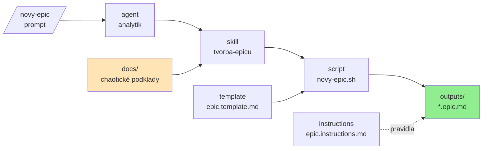

# ⭐️ L3 workshop — demo repo

Ukázka, jak si postavit vlastní „AI framework" nad GitHub Copilotem. Celé demo řeší
**jeden use case: vytvoření epicu z chaotických podkladů**.

Podklady v `docs/` popisují projekt **Finanční ukazatel**. Pocházejí od různých lidí
(PM, business owner, architekt, legal, UX) a **úmyslně si odporují** — to je záměr,
cvičení je o tom rozpory najít a zapsat, ne o tom je rozhodnout.

## 🧱 AI artefakty v tomto repu

Všechny jsou záměrně **prázdné kostry s TODO** — obsah do nich doplníš na workshopu.

| Artefakt        | Soubor                                        | K čemu je                          |
| --------------- | --------------------------------------------- | ---------------------------------- |
| agent instrukce | `.github/copilot-instructions.md`             | vždy platný kontext projektu       |
| instructions    | `.github/instructions/epic.instructions.md`   | pravidla pro soubory `*.epic.md`   |
| prompt          | `.github/prompts/novy-epic.prompt.md`         | vstupní bod `/novy-epic`            |
| agent           | `.github/agents/analytik.agent.md`            | role a operating flow              |
| skill           | `.github/skills/tvorba-epicu/`                | postup nad jedním typem artefaktu  |
| script          | `.../tvorba-epicu/scripts/novy-epic.sh`       | deterministický krok místo modelu  |
| template        | `.../tvorba-epicu/assets/epic.template.md`    | struktura výstupu                  |

## 🗂️ Struktura repa

- `docs/` — chaotické podklady k projektu (zdroj pravdy)
- `outputs/` — vygenerované výstupy
- `.github/` — vlastní AI framework nad Copilotem

## ▶️ Jak s tím pracovat

1. Otevři jeden artefakt a nahraď TODO vlastním obsahem.
2. Zkus ho v chatu (např. `/novy-epic`) a podivej se, co se změnilo.
3. Přidej další artefakt tam, kde ti něco chybí.

## 🔍 Na co se u toho dívat

- Co patří do **instructions** a co už do **skillu**?
- Proč zakládá soubor **skript** a ne model?
- Co by se stalo, kdyby **template** neexistoval?
- Proč má **agent** delegovat na skill místo vlastního postupu?

